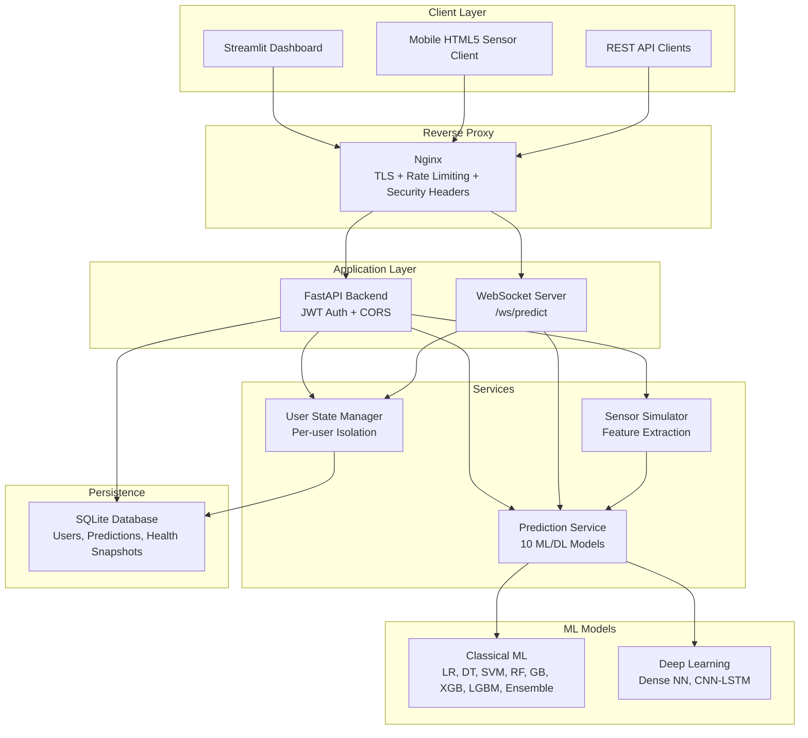

# Human Activity Recognition (HAR) — Production System


An end-to-end Machine Learning and Deep Learning system for Human Activity Recognition using smartphone accelerometer and gyroscope data from the [UCI HAR Dataset](https://archive.ics.uci.edu/dataset/240/human+activity+recognition+using+smartphones).

---

## Table of Contents

- [Models Implemented](#models-implemented)
- [Key Features](#key-features)
- [System Architecture](#system-architecture)
- [Quick Start](#quick-start)
- [API Documentation](#api-documentation)
- [Environment Variables](#environment-variables)
- [Project Structure](#project-structure)
- [Testing](#testing)
- [Docker Deployment](#docker-deployment)
- [Security Notes](#security-notes)
- [Limitations & Important Notes](#limitations--important-notes)
- [Contributing](#contributing)
- [License](#license)

---

## Models Implemented

| Category | Model | Test Accuracy | Macro F1 | Latency (ms/sample) | Framework |
|----------|-------|---------------|----------|---------------------|-----------|
| **Classical ML** | Logistic Regression | 96.13% | 96.12% | 0.003 ms | scikit-learn |
| **Classical ML** | Decision Tree | 85.48% | 85.13% | 0.004 ms | scikit-learn |
| **Classical ML** | Random Forest | 92.47% | 92.28% | 0.037 ms | scikit-learn |
| **Classical ML** | Gradient Boosting | 93.01% | 92.95% | 0.215 ms | scikit-learn |
| **Classical ML** | Support Vector Machine (SVM) | 95.05% | 94.99% | 1.468 ms | scikit-learn |
| **Advanced Trees** | XGBoost | 93.25% | 93.17% | 0.013 ms | XGBoost |
| **Advanced Trees** | LightGBM | 94.20% | 94.16% | 0.019 ms | LightGBM |
| **Ensemble** | Soft-Voting (LR + RF + SVM) | 95.83% | 95.78% | 1.264 ms | scikit-learn |
| **Deep Learning** | Dense Neural Network (MLP) | 92.98% | 93.03% | 0.070 ms | TensorFlow/Keras |
| **Deep Learning** | 1D-CNN + LSTM (Raw 128×9) | 87.85% | 87.80% | 0.352 ms | TensorFlow/Keras |

> **Per-Class Insights & Evaluation Methodology:** While headline accuracy is high across models, multiclass evaluation requires looking beyond single-number accuracy. Dynamic activities (*Walking*, *Walking Upstairs*, *Walking Downstairs*) and *Laying* achieve near-perfect classification (>96–100% recall), whereas static postures (*Sitting* vs. *Standing*) represent the primary confusion boundary due to similar stationary gravity vectors. Full per-class classification reports and confusion matrix plots are saved in `models/`.

---

## Key Features

1. **Real-Time Sensor Streaming & Simulation** — 50 Hz tri-axial accelerometer & gyroscope signals (128 samples × 9 channels) with 561-feature extraction pipeline.
2. **WebSocket Streaming & REST API** — WebSocket endpoint for live prediction streams, plus OpenAPI REST endpoints for single, batch, and sensor window predictions.
3. **CNN-LSTM Sequence Prediction** — Dedicated `/predict/sequence` endpoint for temporal sensor sequences (128 × 9) using the CNN-LSTM model.
4. **Prediction Smoothing** — Rolling window majority voting and confidence averaging.
5. **Prediction History & Tracking** — Persistent SQLite storage, session tracking, activity transition detection, and CSV/JSON export.
6. **Estimated Health Metrics & Fitness Analytics** — Step counting, MET-based calorie burn estimation, distance calculations, active vs. sedentary time tracking. ⚠️ _These are approximate estimates, not clinically validated measurements._
7. **JWT Authentication** — bcrypt password hashing, user registration, login, and per-user data isolation.
8. **Modern Dashboard (Streamlit & Plotly)** — 7 interactive tabs: Dashboard, Live Monitor, Predict, Model Comparison, Analytics, Health Metrics, About.
9. **Mobile Sensor Client** — HTML5 `devicemotion` sensor streamer at `/sensor` for real phone-to-model predictions.
10. **Production & DevOps** — Docker & Docker Compose, Nginx reverse proxy with rate limiting, GitHub Actions CI, Prometheus metrics (optional).

---

## System Architecture



---

## Quick Start

### 1. Clone & Install

```bash
git clone https://github.com/veddd01/Human-Activity-Recognition-HAR.git
cd Human-Activity-Recognition-HAR
pip install -r requirements.txt
```

### 2. Prepare Data & Train Models (optional — pre-trained models included)

```bash
python -m src.data        # Download UCI HAR dataset
python -m src.train       # Train all 10 models
python -m src.evaluate    # Generate evaluation artifacts
```

### 3. Configure Environment

```bash
cp .env.example .env
# Edit .env — at minimum, set HAR_JWT_SECRET for production
```

### 4. Run FastAPI Backend

```bash
uvicorn api:app --host 0.0.0.0 --port 8000 --reload
```

### 5. Run Streamlit Dashboard

```bash
streamlit run app.py
```

### 6. Docker Deployment

```bash
# Development
docker-compose up -d --build

# Production (with Nginx reverse proxy)
docker-compose -f docker-compose.prod.yml up -d --build
```

---

## API Documentation

Once `api.py` is running:

| Resource | URL |
|----------|-----|
| Swagger UI | `http://localhost:8000/docs` |
| ReDoc | `http://localhost:8000/redoc` |
| WebSocket | `ws://localhost:8000/ws/predict` |
| Sensor Client | `http://localhost:8000/sensor` |
| Prometheus Metrics | `http://localhost:8000/metrics` (if enabled) |

### Endpoints

| Method | Path | Auth | Description |
|--------|------|------|-------------|
| `GET` | `/` | — | Health check |
| `GET` | `/models` | — | List loaded models |
| `POST` | `/predict` | Optional | Single prediction (561 features) |
| `POST` | `/predict/batch` | Optional | Batch prediction |
| `POST` | `/predict/sequence` | Optional | CNN-LSTM sequence prediction (128×9) |
| `POST` | `/sensor/ingest` | Optional | Simulated sensor window prediction |
| `GET` | `/sensor` | — | Mobile sensor client HTML |
| `WS` | `/ws/predict` | Token | Live WebSocket streaming |
| `GET` | `/history` | Optional | Prediction history |
| `GET` | `/history/stats` | Optional | Prediction statistics |
| `GET` | `/history/export` | **Required** | Export history (CSV/JSON) |
| `GET` | `/activity/summary` | — | Daily activity summary |
| `GET` | `/health-metrics` | Optional | Estimated health metrics snapshot |
| `POST` | `/auth/register` | — | Register new user |
| `POST` | `/auth/login` | — | Login & get JWT |
| `GET` | `/auth/profile` | **Required** | User profile |

---

## Environment Variables

| Variable | Required | Default | Description |
|----------|----------|---------|-------------|
| `HAR_JWT_SECRET` | **Yes** (prod) | _(fails fast)_ | JWT signing secret — generate with `python -c "import secrets; print(secrets.token_urlsafe(64))"` |
| `DATABASE_URL` | No | `sqlite:///<root>/data/har_data.db` | Database connection string |
| `HAR_CORS_ORIGINS` | No | `*` (dev) | Comma-separated allowed origins. Set explicit origins for production. |
| `HAR_SEED_DEMO_USERS` | No | `false` | Seed demo admin/user accounts (development only) |
| `HAR_ENVIRONMENT` | No | `development` | Set to `production` to enforce security requirements |

---

## Project Structure

```
HAR/
├── api.py                   # FastAPI backend (REST + WebSocket)
├── app.py                   # Streamlit dashboard
├── requirements.txt         # Python dependencies
├── Dockerfile               # Container image
├── docker-compose.yml       # Dev compose
├── docker-compose.prod.yml  # Prod compose (with Nginx)
├── .env.example             # Environment template
├── models/                  # Pre-trained model files
│   ├── *.pkl                # Scikit-learn models
│   ├── *.keras              # TensorFlow/Keras models
│   ├── activity_labels.csv  # Label mapping
│   └── training_metadata.json
├── src/                     # Source modules
│   ├── auth.py              # JWT + bcrypt authentication
│   ├── database.py          # SQLAlchemy ORM + SQLite
│   ├── data.py              # UCI HAR dataset loading
│   ├── train.py             # Model training pipeline
│   ├── evaluate.py          # Model evaluation
│   ├── sensor_simulator.py  # Sensor data simulation
│   ├── prediction_smoother.py
│   ├── prediction_history.py
│   ├── activity_tracker.py
│   ├── health_metrics.py
│   ├── startup_validation.py
│   └── utils.py
├── static/
│   └── sensor.html          # Mobile HTML5 sensor client
├── tests/                   # Test suite
│   ├── conftest.py          # Shared fixtures
│   ├── test_api.py          # API endpoint tests
│   └── test_models.py       # Unit tests
├── deploy/
│   └── nginx.conf           # Nginx reverse proxy config
├── docs/
│   └── DEPLOYMENT.md        # AWS deployment guide
└── .github/workflows/
    └── ci.yml               # GitHub Actions CI
```

---

## Testing

```bash
# Run all tests
pytest tests/ -v

# Run with coverage
pytest tests/ -v --tb=short
```

---

## Docker Deployment

```bash
# Development (ports exposed directly)
docker-compose up -d --build

# Production (Nginx reverse proxy with rate limiting)
docker-compose -f docker-compose.prod.yml up -d --build
```

For HTTPS in production, configure TLS certificates in `deploy/nginx.conf` and uncomment the HTTPS server block.

---

## Security Notes

> **⚠️ Important:** Review these items before any production deployment.

- **JWT Secret:** Always set `HAR_JWT_SECRET` to a strong, randomly generated value. The application will refuse to start in production without it. Generate one with:
  ```bash
  python -c "import secrets; print(secrets.token_urlsafe(64))"
  ```
- **Demo Users:** Set `HAR_SEED_DEMO_USERS=false` (the default) in production. Demo accounts use known passwords.
- **CORS:** Configure `HAR_CORS_ORIGINS` with your specific frontend domain(s) instead of the wildcard `*`.
- **HTTPS:** Enable TLS termination at Nginx or your cloud load balancer. The provided `nginx.conf` includes a commented HTTPS template.
- **Rate Limiting:** Nginx rate limiting is configured for auth and prediction endpoints. Adjust `limit_req_zone` parameters in `nginx.conf` as needed.

---

## Limitations & Important Notes

### Health Metrics Are Estimates

Calories burned, distance, step counts, and active/sedentary time are **approximate estimates** derived from predicted activity classes using standard MET (Metabolic Equivalent of Task) values. They are **not** clinically validated medical measurements and should not be used for medical decision-making.

### Sensor Simulation vs. Real Sensors

The built-in sensor simulator (`/sensor/ingest`, WebSocket simulation mode) generates **synthetic data** from statistical activity profiles. It does **not** validate real-world sensor generalization. For genuine real-time HAR, connect actual IMU hardware (smartphone sensors, MPU6050, BMI160, BNO055, etc.) via the `/ws/predict` WebSocket endpoint or the `/sensor` HTML5 client.

### Two Inference Pipelines

The project contains two distinct inference paths:

1. **Classical ML pipeline:** Raw 9-axis sensor → 561 engineered features → scikit-learn/XGBoost/LightGBM model
2. **Deep Learning pipeline:** Raw 9-axis sensor sequence (128×9) → CNN-LSTM model

These pipelines have different input requirements and latency/accuracy trade-offs. The classical pipeline requires feature extraction; the CNN-LSTM operates directly on raw temporal sequences.

### Evaluation Methodology

Model evaluation uses the standard UCI HAR train/test split. For rigorous validation, consider subject-aware cross-validation (e.g., `GroupKFold` by subject ID) to avoid identity leakage across splits.

---

## Contributing

Contributions are welcome! To get started:

1. Fork the repository
2. Create a feature branch (`git checkout -b feature/your-feature`)
3. Install dependencies: `pip install -r requirements.txt`
4. Run tests: `pytest tests/ -v`
5. Submit a pull request

Please ensure all tests pass before submitting.

---

## License

This project is released under the [MIT License](LICENSE).

This project uses the [UCI HAR Dataset](https://archive.ics.uci.edu/dataset/240/human+activity+recognition+using+smartphones) (Anguita et al., 2013). If you use this dataset, please cite the original authors.
